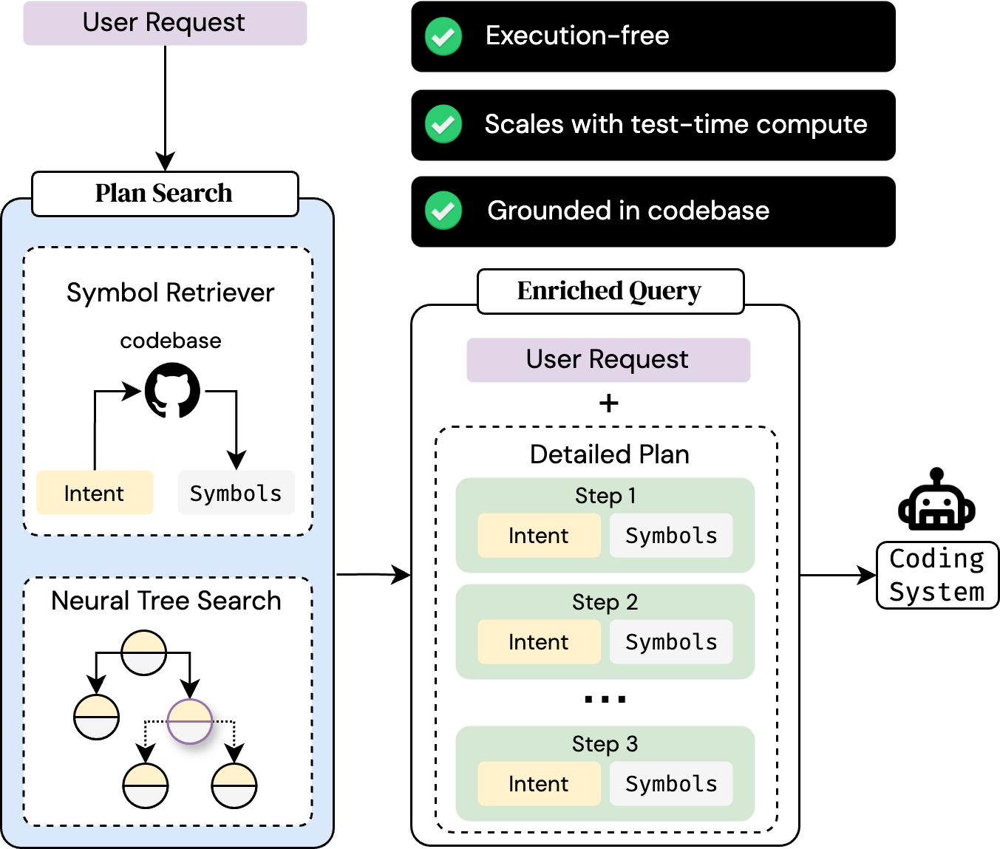

# MutaGReP: Execution-Free Repository-Grounded Plan Search for Code-Use

[Zaid Khan](https://zaidkhan.me/)<sup>1</sup>, [Ali Farhadi](https://homes.cs.washington.edu/~ali/)<sup>2</sup>, [Ranjay Krishna](https://www.ranjaykrishna.com/index.html)<sup>2</sup>, [Luca Weihs](https://lucaweihs.github.io/)<sup>3</sup>, [Mohit Bansal](https://www.cs.unc.edu/~mbansal/)<sup>1</sup>, [Tanmay Gupta](https://tanmaygupta.info/)<sup>2</sup>

<sup>1</sup>University of North Carolina, Chapel Hill   <sup>2</sup>Allen Institute for Artificial Intelligence (AI2)   <sup>3</sup>Vercept AI

[📄 Paper](https://arxiv.org/abs/2502.15872)  [🌐 Website](https://zaidkhan.me/MutaGReP)

---

Given a user request that requires writing code against a specific codebase, MutaGReP searches for realizable plans to solve the user's request using LLM-guided tree search. The search procedure explores viable solutions by mutating plans while constraining them to symbols available in the codebase. The user request and detailed plan serve as an enriched query that provides necessary structured repo context to downstream coding systems, improving repo-level code generation performance.

<div align="center">
    
</div>

# Installation
```bash
conda create -n mutagrep python=3.10
conda activate mutagrep
pip install -r requirements.txt
pip install -e .
# If linting doesn't work in VSCode, run the command below
pip install -e . --config-settings editable_mode=compat --no-deps --force-reinstall
```

# Getting Started
First, make sure `OPEN_API_KEY` is set in your environment.
Then, execute `examples/run_plan_search_for_repo.py`. This will:
- Mine symbols from the repository.
- Generate synthetic intents for each symbol.
- Embed the intents and index them in a vector database.
- Run plan search for the user query.
The output of each step will be cached, so if you run the script again, it will skip the steps that have already been completed.

Here's an example command:

```bash
python3 examples/run_plan_search_for_repo.py \
    --user_query "Run plan search for all LongCodeArena repositories. Use best first search with a priority queue and use any ranker. Use an unconstrained successor function." \
    --repo_path src/mutagrep \
    --core_paths "[src/mutagrep/plan_search, src/mutagrep/longcodearena, src/mutagrep/coderec/v3/symbol_mining.py]"
```
This should take about 4 minutes to run the first time, and subsequent runs will be much faster.

This will output a `plan_search_outputs` directory with the following structure:
```
Directory structure:
└── /plan_search_outputs/
    ├── cache/
    │   └── mutagrep/
    │      ├── symbols.jsonl
    │      ├── synthetic_intents.jsonl
    │      ├── core_file_names.json
    │      ├── progress_cache.db
    │      └── embed_synthetic_intents.completion_marker
    └── mutagrep/
        └── 2025-02-23T14:53:59.173112/
            ├── plan_search_result.json
            ├── rank_0_score_32_plan.md
            ...
            └── rank_9_score_29_plan.md
```

See [docs/example_human_readable_plan.md](docs/example_human_readable_plan.md) for an example of a markdown file containing a human readable plan corresponding to the highest scoring plan in the output directory (`rank_0_score_32_plan.md`).

You can read the output of the plan search using the following code snippet:
```python
from mutagrep.plan_search.generic_search import SearchResult
from mutagrep.plan_search.components import PlanStep, GoalTest

with open("docs/plan_search_result_example.json", "r") as f:
    plan_search_output = SearchResult[PlanStep, GoalTest].model_validate_json(f.read())
```

This will output a `plan_search_outputs` directory with the following structure:
```
Directory structure:
└── /plan_search_outputs/
    ├── cache/
    │   └── mutagrep/
    │      ├── symbols.jsonl
    │      ├── synthetic_intents.jsonl
    │      ├── core_file_names.json
    │      ├── progress_cache.db
    │      └── embed_synthetic_intents.completion_marker
    └── mutagrep/
        └── 2025-02-23T14:53:59.173112/
            ├── plan_search_result.json
            ├── rank_0_score_32_plan.md
            ...
            └── rank_9_score_29_plan.md
```

See [docs/example_human_readable_plan.md](docs/example_human_readable_plan.md) for an example of a markdown file containing a human readable plan corresponding to the highest scoring plan in the output directory (`rank_0_score_32_plan.md`).

You can read the output of the plan search using the following code snippet:
```python
from mutagrep.plan_search.generic_search import SearchResult
from mutagrep.plan_search.components import PlanStep, GoalTest

with open("docs/plan_search_result_example.json", "r") as f:
    plan_search_output = SearchResult[PlanStep, GoalTest].model_validate_json(f.read())
```

The `core_paths` argument is optional. If provided, the plan search will only consider symbols in these files. This can be helpful to narrow down the search space. Changing these paths will invalidate the cache and trigger re-indexing. 

To manually invalidate the cache, delete the `cache` subdirectory in the output directory (by default, `plan_search_outputs`).

# Repository Structure
See [docs/repo_structure.md](docs/repo_structure.md) for info on important directories and where to find different components of the codebase.

# Repository Structure
See [docs/repo_structure.md](docs/repo_structure.md) for info on important directories and where to find different components of the codebase.

# Reference

If you find this work helpful, please cite:
```bibtex
@article{khan2025mutagrep,
  title={MutaGReP: Execution-Free Repository-Grounded Plan Search for Code-Use},
  author={Khan, Zaid and Farhadi, Ali and Krishna, Ranjay and Weihs, Luca and Bansal, Mohit and Gupta, Tanmay},
  journal={arXiv preprint arXiv:2502.15872},
  year={2025}
}
```